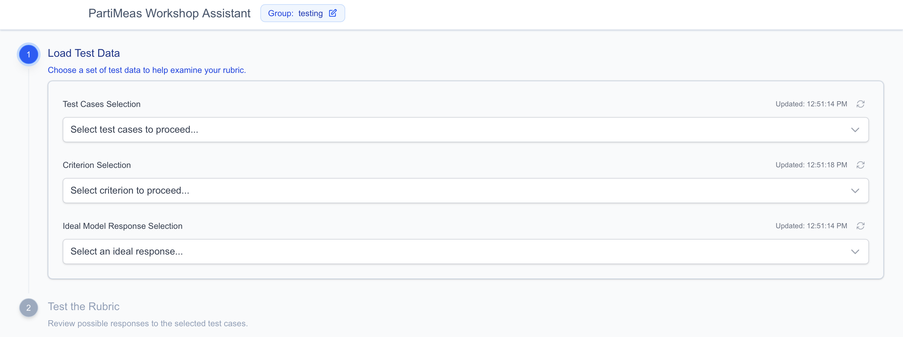
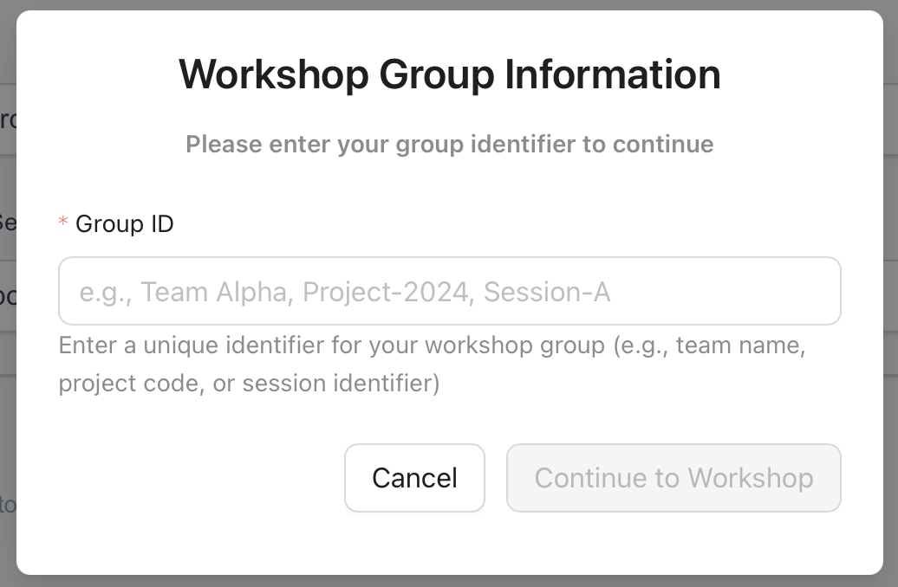
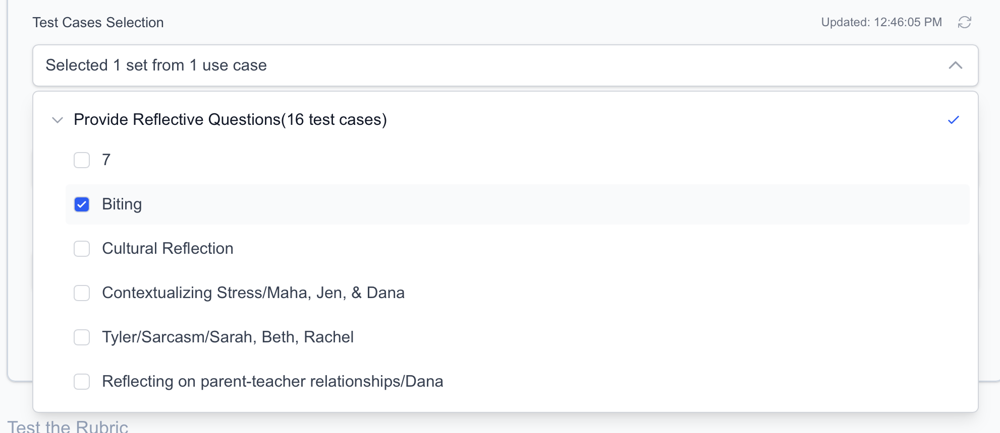
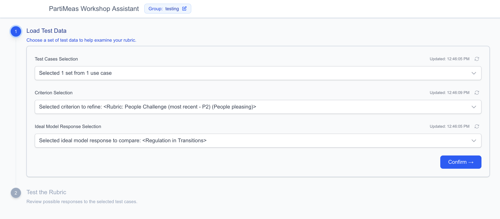
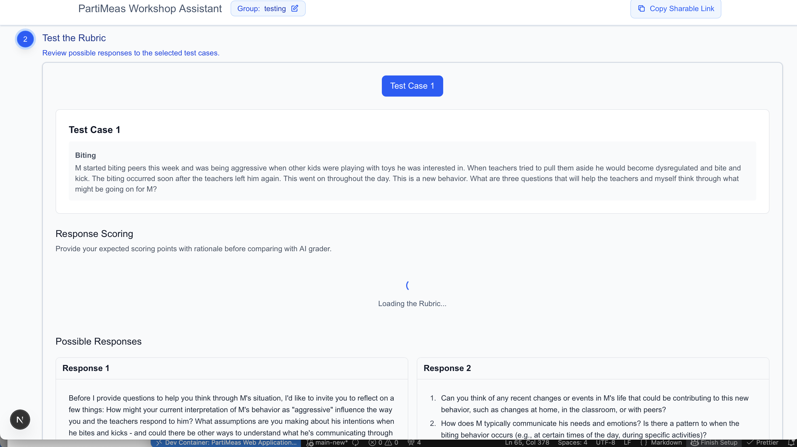
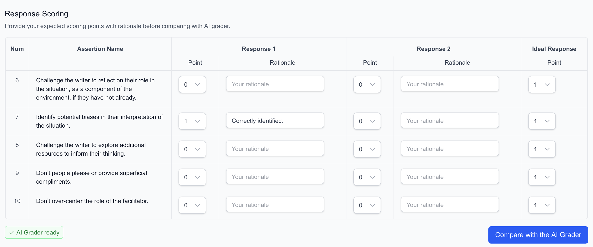
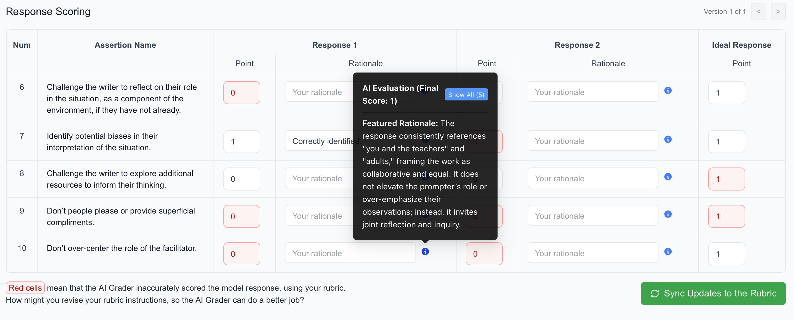

# Rubric Refiner

## Installation

### 1. Clone the repository

```bash
git clone https://github.com/zqh0421/partimeas.git
cd partimeas
```

### 2. Setup the Environment

#### With VS Code:

1. Install Docker Desktop and make sure it’s running.
2. Install the Dev Containers extension (by Microsoft) in VS Code.
3. When prompted, select “Reopen in Container” to automatically setup the environment. If you don’t see the prompt, press F1 → search for Dev Containers: Reopen in Container.

### 3. Install dependencies

```bash
cd web && pnpm install
```

### 4. Set up environment variables (in `/partimeas/web`)

Add `.env.local` based on the format in `.env.example`.

### 5. Run the development server (in `/partimeas/web`)

```bash
pnpm dev
```

### 6. Open [http://localhost:5666](http://localhost:5666) in your browser.

### 7. (Optional) Test the deployment version

```bash
# (1) Build for production
pnpm build:no-lint

# (2) Start production server
pnpm start
```

## Instructions: How to refine your rubric with this tool

1. Open the app at `http://localhost:5666` (local) or `https://partimeas.vercel.app/` (deployed).

   

2. If prompted, enter your **Group ID**. This links your session data and scoring history to your team.

   

3. In `Step 1: Load Test Data`, select the test case set, criteria, and ideal response set, then click **Confirm**.  
   If dropdown data does not load, click the refresh/spinner button or reload the page.

   
   

4. In `Step 2: Test the Rubric`, review:
   - the selected test case,
   - generated model responses from different `(LLM × system prompt)` combinations,
   - the rubric criteria.
     Then score each response in the `Response Scoring` section and optionally add your rationale notes.

   
   

5. After both you and the AI grader finish scoring:
   - Click `Compare with the AI Grader` to inspect differences (mismatches are highlighted in red).
   - Hover the blue info icon to review AI grading rationale and identify rubric updates.
   - After updating the rubric in Google Sheets, click `Sync Updates to the Rubric` to re-score with the latest rubric.
   - To collaborate or revisit later, click `Copy Sharable Link` in the page header.

   

6. Repeat instructions 4-5 as needed for iterative refinement.  
   You can browse version history with the `<` and `>` controls at the top-right of the `Response Scoring` section.

## Project Structure ([Next.js App Router](https://nextjs.org/docs/app/getting-started/project-structure))

```
partimeas/
└── web/
    ├── app/                               # App Router pages, layouts, and route handlers
    │   ├── admin/
    │   │   ├── layout.tsx
    │   │   └── page.tsx                   # Admin settings UI
    │   ├── api/                           # Backend endpoints (LLM, sessions, config, evaluation)
    │   │   ├── admin/
    │   │   ├── model-evaluation/
    │   │   ├── sessions/
    │   │   └── ...
    │   ├── workshop-assistant/
    │   │   ├── layout.tsx
    │   │   ├── page.tsx                   # Main workshop assistant interface
    │   │   └── session/[sessionId]/       # Shareable session page
    │   ├── layout.tsx                     # Root layout
    │   ├── page.tsx                       # Home page
    │   ├── globals.css                    # Global styles (Tailwind CSS v4)
    │   └── loading.tsx
    ├── components/
    │   ├── admin/                         # Admin UI building blocks
    │   └── workshop-assistant/            # Assistant UI modules (steps, evaluation, output)
    ├── hooks/                             # Custom React hooks for app flows and data loading
    ├── config/                            # App-level configuration (criteria, DB, LangSmith, use cases)
    ├── types/                             # Shared TypeScript types
    ├── utils/                             # Shared utilities (DB, scoring, auth, formatting)
    ├── public/                            # Static assets
    ├── middleware.ts
    ├── .env.example                       # Environment variable template
    ├── .env.local                         # Local environment variables [Need to be manually added]
    └── package.json                       # Scripts and dependencies
```
